# svnsgmntdsply

## Overview

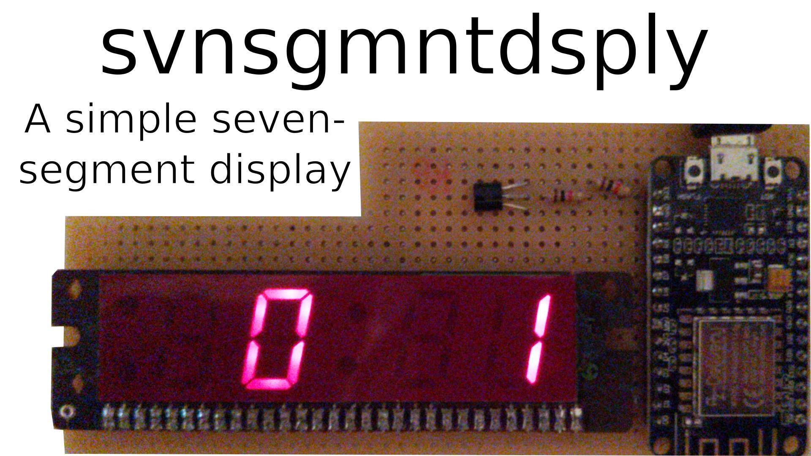

This is a simple ESP8266-driven seven-segment display.

## Dependencies

I generally try to minimize dependencies, but I'm a one man crew and can therefore only support Debian-based Linux distributions as I'm running one myself. Anyway, you need to have the following packages installed for everything to work properly:

- Arduino IDE as a way to compile the Arduino code. Install it with `sudo apt install arduino`.
- Arduino ESP8266 LittleFS uploader for uploading the data. Install it via the [installation guide](https://github.com/earlephilhower/arduino-esp8266littlefs-plugin).

## How to build it

Simply wire the ESP up to the display like this:

| Display pin: | ESP8266 pin: |
| --- | --- |
| 1 | D0 |
| 2 | D0 inverted with NOT gate |
| 9 | 1 (TX) |
| 10 | 3 (RX) |
| 12 | D8 |
| 13 | D7 |
| 15 | D6 |
| 16 | D5 |
| 17 | D4 |
| 18 | D3 |
| 19 | D2 |
| 20 | D1 |
| 21 | 10 (SD3) |

Personally, I soldered this simple circuit on a piece of perfboard. Not the most beautiful thing ever made, but it works:

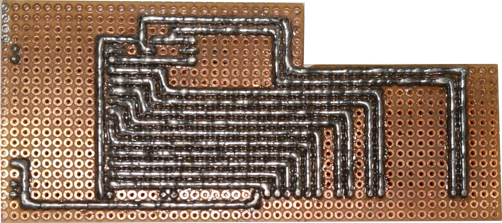

## How to use it

1. Put your Wi-Fi credentials into the code and flash the sketch.
2. Upload the additional files via the Arduino ESP8266 LittleFS uploader.
3. Power the ESP on and give it roughly half a minute to boot up.
4. Open `svnsgmntdsply.local` (or enter the IP address of the ESP manually) on a device that is connected to the same network.
5. Enter a text you like (see available characters down below) and enjoy the glory of seven-segment displays.

## Segment labels

## Number codes

| Number: | Code (ABCDEFG): | Preview: |
| --- | --- | --- |
| 0 | 1111110 |  |
| 1 | 0110000 |  |
| 2 | 1101101 |  |
| 3 | 1111001 |  |
| 4 | 0110011 |  |
| 5 | 1011011 |  |
| 6 | 1011111 |  |
| 7 | 1110000 |  |
| 8 | 1111111 |  |
| 9 | 1111011 |  |

## Uppercase letter codes

| Letter: | Code (ABCDEFG): | Preview: |
| --- | --- | --- |
| A | 1110111 |  |
| B | 1111111 | 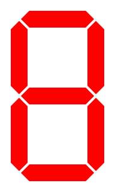 |
| C | 1001110 |  |
| D | 1111100 |  |
| E | 1001111 |  |
| F | 1000111 |  |
| G | 1011110 |  |
| H | 0110111 |  |
| I | 0000110 |  |
| J | 0111000 |  |
| K | 1010111 |  |
| L | 0001110 |  |
| M | 1101010 |  |
| N | 1110110 |  |
| O | 1111110 |  |
| P | 1100111 |  |
| Q | 1101011 |  |
| R | 1101111 |  |
| S | 1011011 |  |
| T | 1000110 |  |
| U | 0111110 |  |
| V | 0111010 |  |
| W | 1011100 |  |
| X | 1001001 |  |
| Y | 0101011 |  |
| Z | 1101101 |  |

## Lowercase letter codes

| Letter: | Code (ABCDEFG): | Preview: |
| --- | --- | --- |
| a | 0011001 | 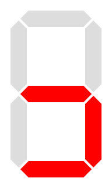 |
| b | 0011111 |  |
| c | 0001101 | 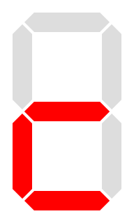 |
| d | 0111101 |  |
| e | 0001100 | 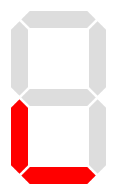 |
| f | 0000111 | 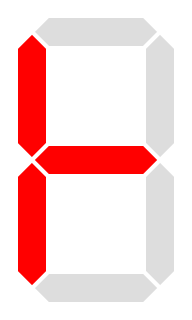 |
| g | 1001101 |  |
| h | 0010111 | 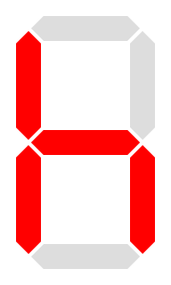 |
| i | 1001100 | 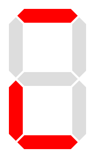 |
| j | 1011000 | 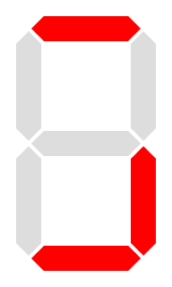 |
| k | 1001011 | 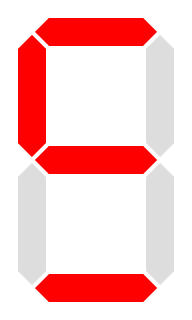 |
| l | 0000110 |  |
| m | 1010101 |  |
| n | 0010101 |  |
| o | 0011101 |  |
| p | 1100111 |  |
| q | 1110011 |  |
| r | 0000101 |  |
| s | 0011000 | 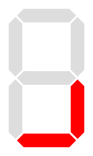 |
| t | 0001111 |  |
| u | 0011100 |  |
| v | 0011000 |  |
| w | 0101010 | 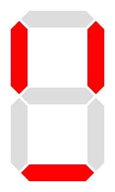 |
| x | 0001001 |  |
| y | 0111011 | 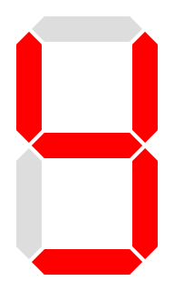 |
| z | 0001001 | 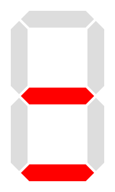 |

## Other character codes

| Character: | Code (ABCDEFG): | Preview: |
| --- | --- | --- |
| Space ( ) | 0000000 |  |
| Underscore (_) | 0001000 | 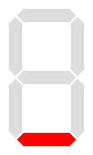 |
| Hyphen-minus (-) | 0000001 |  |
| Equals (=) | 0001001 |  |
| Double quote (") | 0100010 | 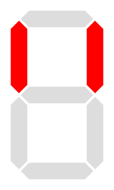 |
| Single quote (') | 0000010 | 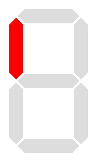 |
| Open parenthesis (() | 1001110 |  |
| Close parenthesis ()) | 1111000 | 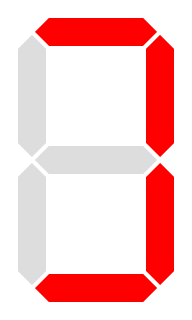 |
| Question mark (?) | 1100101 | 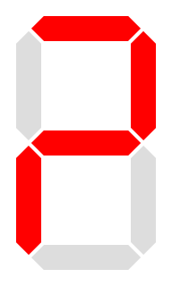 |

## Current paths

| Segment (digit - segment): | Current path (GND pin - VCC pin): |
| --- | --- |
| AM | 1-5 |
| PM | 3-4 |
| 1-A | 1-7 |
| 1-B | 2-6 |
| 1-C | 2-9 |
| 1-D | 1-8 |
| 1-E | 2-8 |
| 1-F | Does not exist |
| 1-G | 2-7 |
| 2-A | 2-13 |
| 2-B | 2-10 |
| 2-C | 2-12 |
| 2-D | 1-12 |
| 2-E | 1-9 |
| 2-F | 1-13 |
| 2-G | 1-10 |
| Colon | 1-30 |
| 3-A | 1-15 |
| 3-B | 1-16 |
| 3-C | 1-17 |
| 3-D | 2-17 |
| 3-E | 2-18 |
| 3-F | 2-15 |
| 3-G | 2-16 |
| 4-A | 2-21 |
| 4-B | 2-19 |
| 4-C | 2-20 |
| 4-D | 1-20 |
| 4-E | 1-18 |
| 4-F | 1-21 |
| 4-G | 1-19 |
| Alarm | 28-27 |

## Sources

- https://en.wikipedia.org/wiki/Seven-segment_display
- https://en.wikipedia.org/wiki/Seven-segment_display_character_representations
- https://libesz.digitaltrip.hu/digital-clock/
